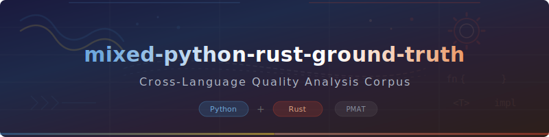

<p align="center">
  
</p>

<h1 align="center">mixed-python-rust-ground-truth</h1>

<p align="center">
  <strong>Cross-Language Quality Analysis Corpus (Python + Rust)</strong>
</p>

<p align="center">
  <a href="LICENSE">
    
  </a>
  
  
  
</p>

A ground-truth mixed-language corpus for validating [PMAT](https://github.com/paiml/paiml-mcp-agent-toolkit)'s ability to analyze projects that combine Python reference implementations with Rust native implementations. Tests that `pmat comply check` and `pmat context` correctly handle dual build systems (`Cargo.toml` + `pyproject.toml`).

---

## Table of Contents

- [Overview](#overview)
- [Project Structure](#project-structure)
- [Architecture](#architecture)
- [PMAT Quality Metrics](#pmat-quality-metrics)
- [PMAT Verification](#pmat-verification)
- [Installation](#installation)
- [Usage](#usage)
- [Cross-Language Correspondence](#cross-language-correspondence)
- [Contributing](#contributing)
- [License](#license)

## Overview

This corpus models a common production pattern: **Python for prototyping and testing, Rust for performance-critical implementations**. Both languages implement the same vector math algorithms, enabling cross-language correctness verification.

### What PMAT Validates Against This Corpus

| Capability | Test Target |
|-----------|-------------|
| Mixed Language Detection | `Cargo.toml` + `pyproject.toml` in same project |
| Dual Build Systems | Cargo and Python/pip coexisting |
| Rust Compliance | CB-500 checks on `.rs` files |
| Cross-Language Context | Both `.py` and `.rs` in unified analysis |
| File Health | Mixed source layouts analyzed correctly |
| Dead Code Detection | Multi-directory source scanning |

## Project Structure

```
mixed-python-rust-ground-truth/
  Cargo.toml                     # Rust build configuration
  Cargo.lock                     # Reproducible Rust builds
  pyproject.toml                 # Python build configuration
  Makefile                       # Unified build automation
  src/
    lib.rs                       # Rust: Vector math implementations
    ground_truth/                # Python: Reference implementations
      __init__.py
      vector_math.py             # Python: Same algorithms as lib.rs
  tests/
    test_vector_math.py          # Python: pytest suite
    conftest.py                  # Python: Test fixtures
```

## Architecture

```
  Algorithm Spec        Python Reference        Rust Implementation
  ┌───────────┐        ┌──────────────────┐    ┌──────────────────┐
  │ dot(a, b) │        │ def dot(a, b):   │    │ fn dot(a: &[f64],│
  │ = sum(    │ ──────>│   return sum(    │    │   b: &[f64])     │
  │   a_i*b_i │        │     x*y for x,y  │    │   -> f64 {       │
  │ )         │        │     in zip(a,b))  │    │   a.iter()       │
  └───────────┘        └──────────────────┘    │    .zip(b)       │
                              │                 │    .map(|(x,y)|  │
                        pytest validates        │     x * y)      │
                         correctness            │    .sum()        │
                              │                 └──────────────────┘
                              v                        │
                       ┌──────────────┐                │
                       │ Cross-language│<───────────────┘
                       │ equivalence   │   Same results
                       └──────────────┘
```

## PMAT Quality Metrics

| Category | Score | Notes |
|----------|-------|-------|
| Code Quality | 20.0/26 (76.9%) | Clean Rust code |
| Known Defects | 20.0/20 (100%) | No unwrap/panic |
| Documentation | 8.0/15 (53.3%) | README present |
| File Health | 100% | All files within tolerance |
| Testing Excellence | 6.5/20 (32.5%) | Python tests present |
| Build Performance | 7.0/15 (46.7%) | Basic build config |

## PMAT Verification

```bash
# Full compliance check
pmat comply check -p /path/to/mixed-python-rust-ground-truth

# Project quality score
pmat rust-project-score -p /path/to/mixed-python-rust-ground-truth

# Context generation (analyzes both .rs and .py files)
pmat context -p /path/to/mixed-python-rust-ground-truth

# JSON output for CI/CD
pmat comply check -p . -f json
```

### Expected PMAT Output

**Compliance:**
- Status: COMPLIANT
- CB-500 (Rust): Advisory warnings for missing clippy.toml, deny.toml
- CB-130: Advisory for CLAUDE.md improvements
- File Health: Grade A (100%)

**Scoring:**
- GPU/SIMD Quality: N/A (no GPU code)
- Lean Checks: N/A (not a Lean project)
- Overall: ~42% normalized

## Installation

### Prerequisites

- [Rust](https://rustup.rs) (1.75+)
- [Python](https://python.org) (3.10+)
- [PMAT](https://github.com/paiml/paiml-mcp-agent-toolkit) (v3.4.0+)

### Build

```bash
# Clone
git clone https://github.com/paiml/mixed-python-rust-ground-truth.git
cd mixed-python-rust-ground-truth

# Build Rust
cargo build

# Install Python dependencies
pip install -e .

# Run all tests
make test
```

## Usage

This corpus is designed to be analyzed by PMAT. To validate mixed-language capabilities:

```bash
# Verify mixed detection
pmat comply check -p . --verbose

# Score the project
pmat rust-project-score -p .

# Generate context with both languages
pmat context -p . -o context.md
```

## Cross-Language Correspondence

Both languages implement identical algorithms for verification:

| Function | Python (`vector_math.py`) | Rust (`lib.rs`) |
|----------|---------------------------|-----------------|
| `dot` | `sum(x*y for x,y in zip(a,b))` | `a.iter().zip(b).map(\|(x,y)\| x*y).sum()` |
| `norm` | `sqrt(dot(v, v))` | `dot(v, v).sqrt()` |
| `normalize` | `[x/norm(v) for x in v]` | `v.iter().map(\|x\| x / norm(v)).collect()` |
| `cosine_sim` | `dot(a,b)/(norm(a)*norm(b))` | `dot(a,b) / (norm(a) * norm(b))` |

The Python pytest suite validates correctness of the reference implementations. The Rust implementations can be verified against these reference outputs.

## Contributing

1. All changes directly on `master` branch
2. Run `cargo build && python -m pytest` to verify both languages
3. Run `pmat comply check -p .` before committing
4. Maintain algorithm correspondence between Python and Rust

## License

MIT
